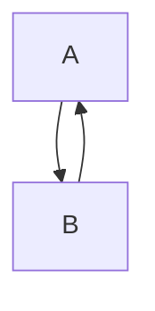
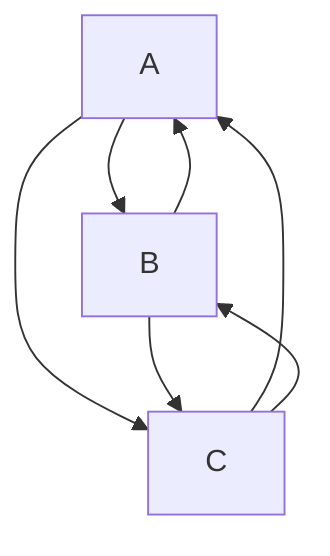
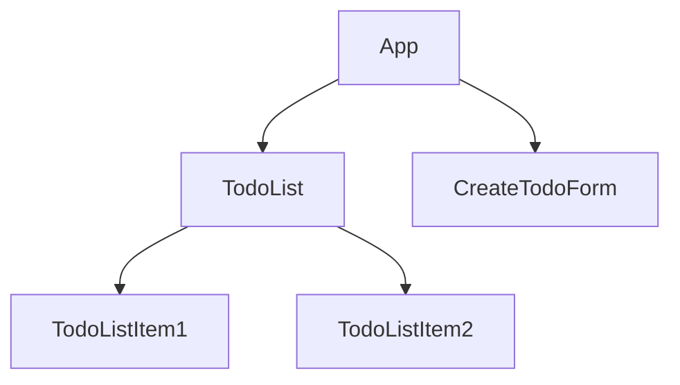
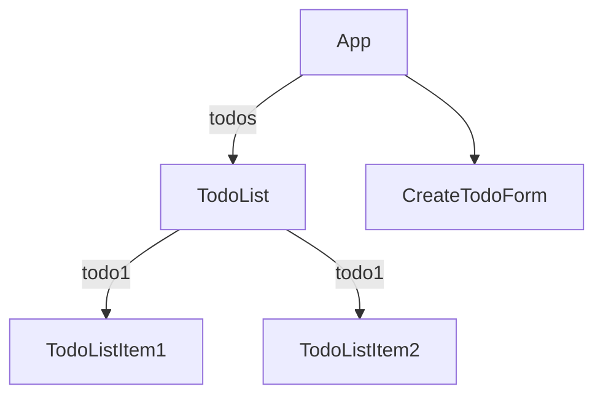
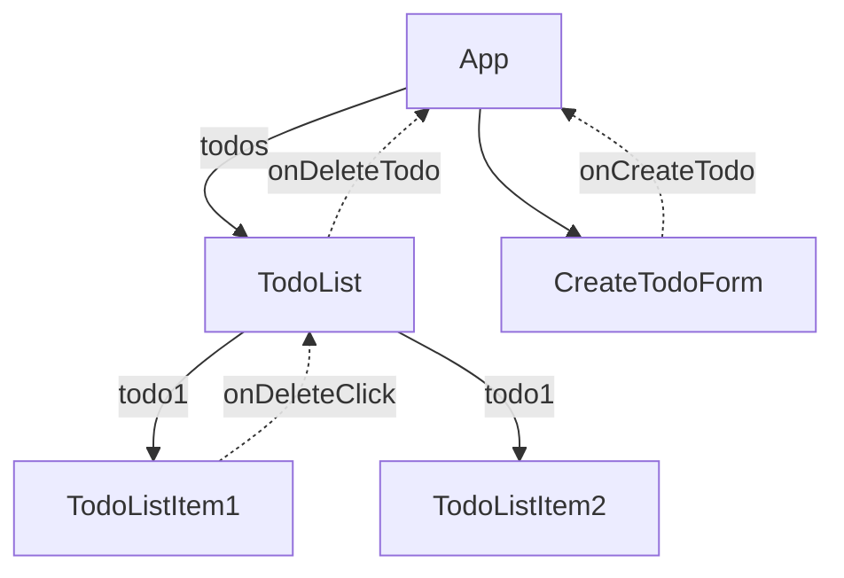

# Introduction to React

by Jan Amann

<div style="text-align: right">
  
</div>

Note:

- About me: Freelancer, occasional open source contributor, specialised on React
- This is part of the introduction to React. The actual lecture will be longer, so this is only part of it

---

```jsx
function App() {
  return <p>Hello world!</p>;
}
```

Note:

- Who has seen code like this before?
- If you're like me, this looks easy.
- Browser doesn't understand this syntax, needs compiler.
- Compiler needs to be used through a bundler.
- Or use a framework?

---

<div style="text-align:center; height:600px">
  
</div>

<p class="img-credits">https://twitter.com/jaredpalmer/status/1142800704580591617</p>

Note:
- Not every website needs to be built with React. We were building web apps since decades.
- Not just technology-wise, but also architecture-wise.

---

<div class="code-huge">

```jsx
<App />
```

</div>

---

<div class="code-huge">

```jsx
<BigApp /> // ?
```

</div>

---

## Why should you learn **React**?

---

## Developers like React

<div style="text-align:center; height:600px">
  
</div>

<div class="img-credits"><a href="https://2021.stateofjs.com/en-US/libraries/front-end-frameworks">

[The State of JS 2021, Frontend frameworks usage](https://2021.stateofjs.com/en-US/libraries/front-end-frameworks)

</div>

---

## Companies like React

- Meta (Facebook)
- Airbnb
- Spotify
- Instagram
- Netflix
- Twitter
- The New York Times
- Yahoo!
- Uber
- Discord
- Skype
- Pinterest
- … many more

---

## Conceptual background

Note: Can be used to evaluate the next big thing.

---

## State transitions



---

## State transitions



Note: 6 transitions

---

## States instead of transitions

```jsx
<App state="A" />
<App state="B" />
<App state="C" />
```

_Declarative_ instead of _imperative_.
<!-- .element: class="fragment" -->
_What_ instead of _how_.
<!-- .element: class="fragment" -->
html = view(state);
<!-- .element: class="fragment" -->

---

## Architecture of React apps



1. App is broken down into isolated pieces

Note: Child components make none to very few assumptions about parents

---

## Architecture of React apps



1. App is broken down into isolated pieces
2. Data flows top-down

Note:
- Children declare a clear interface.
- Data isn't globally available

---

## Architecture of React apps



1. App is broken down into isolated pieces
2. Data flows top-down
3. Events flow bottom-up

Note:
- Parents can handle events
- Parents can intercept events (no two-way databinding)

---

<div style="text-align:center; height:600px">
  
</div>

<p class="img-credits">https://youtu.be/x7cQ3mrcKaY</p>

---

<div style="text-align:center; height:600px">
  
</div>

<p class="img-credits">https://youtu.be/x7cQ3mrcKaY</p>

---

## React decouples the rendering target

1. Render in the browser
2. Render on the server
3. Render native apps (iOS, Android)
4. Render desktop applications
5. … many more

> Learn once, write anywhere. – React Native

<!-- .element: class="fragment" -->

---

## Rendering in React

---

## Hello world with JSX

```jsx
import {createRoot} from 'react-dom/client';

// Define the place in the markup where we render
const node = document.getElementById('root');
const root = createRoot(node);

// Lowercase tags are built-in browser primitives
root.render(<p>Hello world</p>);
```

Note: JSX is a syntax extension and needs a build tool.

---

## Props on native elements

```jsx
// … mostly map to HTML attributes
<p title="Hello">...</p>

// … with some exceptions
<p className="text">...</p>
```

```jsx
// … based on JavaScript APIs – not HTML
document.querySelector('.text').className = 'text';
```
<!-- .element: class="fragment" -->

---

## Components

```jsx

// … start with a capital letter
// … can accept arbitrary props
function Person(props) {
  // … return elements
  return <p>{props.firstName} {props.lastName}</p>;
}

root.render(<Person firstName="Grace" lastName="Hopper" />);
```

---

## Components

```jsx

// … start with a capital letter
// … can accept arbitrary props
function Person({firstName, lastName}) {
  // … return elements
  return <p>{firstName} {lastName}</p>;
}

root.render(<Person firstName="Grace" lastName="Hopper" />);
```

---

## "Escaping" into JavaScript

<div class="code-small">

```jsx

function Person({children, firstName, imageUrl, imageSize = 30}) {
  return (
    <div>
      <h1>{firstName.toUpperCase()}</h1>
      
      <p>{children}</p>
    </div>
  );
}

root.render(
  <Person firstName="Grace" imageUrl="/grace-hopper.jpg">
    was a pioneer of computer programming.
  </Person>
);
```

</div>

Note:

1. Within tags
2. Within attributes
3. Children are special

---

## Conditional rendering

<div class="code-small">

```jsx

function Person({firstName, lastName, isComputerScientist}) {
  let firstNameContent;
  if (firstName != null) {
    firstNameContent = <p>{firstName.upperCase()}</p>;
  }

  return (
    <div>
      <h1>{firstNameContent}</h1>
      <p>{lastName != null && lastName.toUpperCase()}</p>
      <p>{isComputerScientist
        ? '… is a computer scientist'
        : '… had another profession'
      }</p>
    </div>
  );
}

root.render(
  <Person firstName="Grace" lastName="Hopper" isComputerScientist />
);
```

</div>

Note:
1. JSX elements can be assigned to variables
2. Ternaries are good for if/else
3. Booleans are not rendered

---

## Lists

<div class="code-small">

```jsx

const inventors = [{
  id: '1',
  name: 'Grace Hopper',
}, {
  id: '2',
  name: 'Marie Curie'
}];

root.render(
  <div>
    {inventors.map((inventor) =>
      <Person key={inventor.id} name={inventor.name} />
    )}
  </div>
);
```

</div>

Note:
1. Since React uses JavaScript for rendering, we use it for loops as well
2. Keys need to be unique among siblings


---

## Interactivity

---

## Introducing `useState`

```jsx
function Counter() {
  const [count, setCount] = useState(0);

  function onIncrementClick() {
    setCount(count + 1);
  }

  return (
    <div>
      <p>Count: {count}</p>
      <button onClick={onIncrementClick}>Increment</button>
    </div>
  );
}
```

---

<section data-preload data-background-iframe="https://codesandbox.io/s/react-lecture-counter-template-hjy4xg?hidenavigation=1" data-background-interactive>

Note: https://codesandbox.io/s/react-lecture-counter-template-hjy4xg

https://codesandbox.io/embed/react-lecture-counter-template-hjy4xg?hidenavigation=1

How to mirror?

---

## Introducing `useState`

```jsx
root.render(
  <>
    <Counter />
    <Counter />
  </>
);
```

Note:
1. Props can be functions

---

## Rules for state

1. State is isolated to components
2. There should be a single source of truth
3. Shared state is moved to a common parent
4. Computed values are derived
