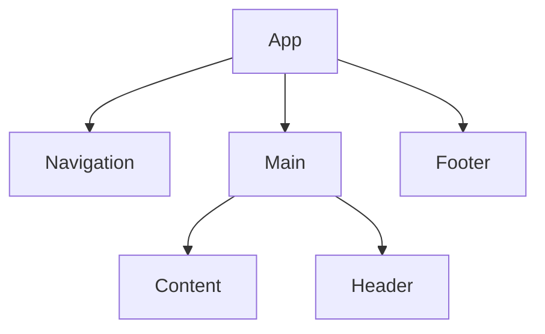

# Presentation title

by Author

<div style="text-align: right">
  
</div>

Notes: Test

---

## A bold statement.

---

## A bold statement with a **highlight**.

---

## A headline about `code`

Text with a **highlight** and some `code`.

---

<div class="layout-vertical-list">

## Horizontal list

- Bullet A
- Bullet B
- Bullet C

</div>

---

## Vertical list

- Bullet A
- Bullet B
- Bullet C

---

## Custom HTML

<div style="color: red">asdf</div>

---

## Graph



---

## Code

Some description

```jsx
function Button({children}) {
  return <button>{children}</button>;
}
```

---

## Unordered appear

Appear 1
<!-- .element: class="fragment" -->

Appear 2
<!-- .element: class="fragment" -->

Note: Doesn't work with bullets

---

<!-- Style only this page -->
<!-- .slide: data-background="green" -->

Theming

---

<!-- .slide: data-background="./images/react-logo.svg" -->

## Background image

---

## Foreground image


---

<div style="display: flex; justify-content: space-between; padding: 20px">
  <div>Column one</div>
  <div>Column two</div>
</div>
