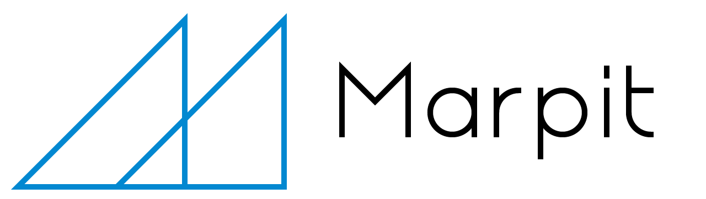

<style>
  pre {
    border: 0;
    padding: 24px;
    line-height: 1.3em;
  }

  .uml img {
    width: 100%;
  }
</style>

# Introduction to React

by Jan Amann


<!-- Speaker notes go here -->

---

# Custom HTML

<div style="color: red">asdf</div>

---

# Graph

@startuml
usecase App
usecase Navigation
usecase Main
usecase Footer

App --> Navigation
App --> Main
App --> Footer
@enduml

---

# Code

Some description

```jsx
function Button({children}) {
  return <button>{children}</button>;
}
```

---

# Unordered appear

- Appear 1
- Appear 2

---

# Ordered instant

1. Appear 1
2. Appear 2

---

# Ordered appear

1. Appear 1
2. Appear 2

---

<!-- Style only this page -->
<!-- _backgroundColor: green -->

Theming

---

Past theming

---

Past theming

---

<style scoped>
  section {
    font-family: Monaco;
  }
</style>

Scoped style

---

<!--
_backgroundImage: url(./images/marpit.png)
 -->

# Background image

---

# Foreground image



---

Past theming

---

<style scoped>
section {
  flex-direction: row;
  gap: 300px;
}
</style>

Column one

Column two

---

<!-- Style all following pages -->
<!--
backgroundColor: orange
color: white
-->

Theming

---

Past theming
